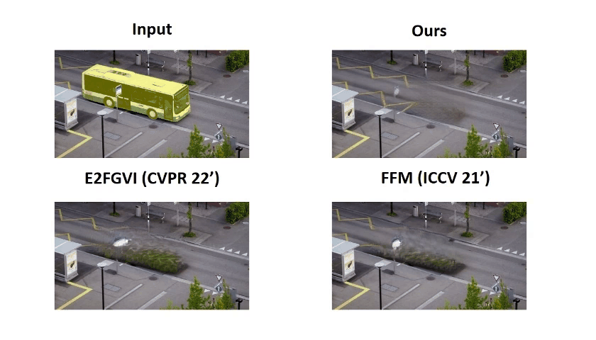
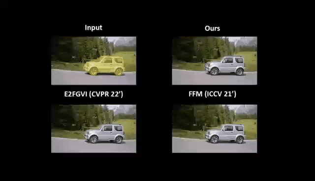
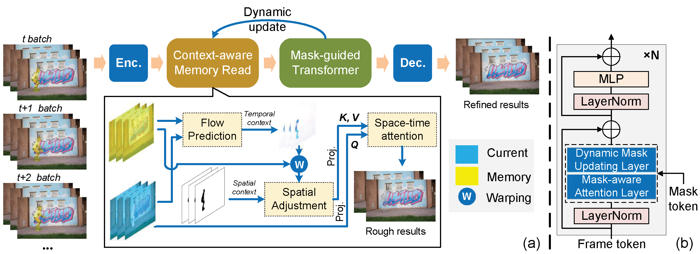

## Abstract
Existing video inpainting methods mainly recover the missing content by retrieving similar patches from known regions. However, due to the temporal correlation of videos, the intermediate predictions (i.e., inpainted frames) can also supply rich cues about the missing region. Motivated by this, we present a new video inpainting model with a dynamic memory bank to employ previous inpainted frames as space-time memory, which aims to dig into the valuable information from both known regions and the intermediate prediction of unknown ones. Specifically, we customize a *Context-aware Memory Read* (CMR) module to integrate spatio-temporal contextual cues for memory reading, ensuring discriminative features being precisely loaded. Besides, we allow the transformer inpainter to distinguish tokens by their sources via our proposed *Mask-Guided Self-Attention* (MGSA) mechanism, where the calculation of self-attention is guided by leveraging the mask information. With the progress of inpainting, the mask is dynamically updated to gradually enable more tokens to be utilized. Experimental results on DAVIS and Youtube-VOS datasets demonstrate our superior performances over the state-of-the-art video inpainting approaches in generating temporally-consistent content and synthesizing fine-grained details.
## Demo

   

Our full demo can be found by clicking [Full demo (Youtube)](https://youtu.be/ztguzv1QSf8).

## Qualitative comparison
We place several examples to compare the visual quality of our method with others under different settings:
 
- *Video Object Removal*: We mask the object in the video to test whether the model could remove the targeted object with an replacement of plausible and temporally-consistent content).

- *Video Corruption Restoration*: We mask the video with dynamic random circles to test whether the model could recovered the degraded video (the mask is generated by [1]).

- *Video dis-occlusion*: We mask a random part of the video to test whether the video could synthesize the occluded part (we employ the same masks as E2FGVI [2], FFM [3], STTN [4]).

## Overview

### ⚡ Highlights:
Our propose model has the following *merits* that others have not:
- **Memorize the Past**: Our method incorporates a dynamic space-time memory in video inpainting, enabling the model to dynamically memorize its past prediction to make the current generation become more temporally-consistent and find-grained. 
- **Distinguish the Reality**: Our method exploits the mask prior for video inpainting to mark each token while calculating correlation in self-attention, which allows the model to distinguish different tokens according to their sources so as to guide the model to produce more faithful results.

**With these two highlights, our model achieves SOTA performance on DAVIS and Youtube-VOS datasets under various mask settings !**

## Reference
We acknowledge the followings works for their open source: 
[1] Free-form Video Inpainting with 3D Gated Convolution and Temporal PatchGAN, Chang et al., In ICCV 2019. 
[2] Towards End-to-End Flow-Guided Video Inpainting, Li et al., In CVPR 2022. 
[3] Fusing Fine-grained Information in Transformers for Video Inpainting, Liu et al., In ICCV 2021. 
[4] Learning Joint Spatio-Temporal Transformations for Video Inpainting, Zeng et al., In ECCV 2020. 
  
